# Guide To Grafana
Whether its on the bench testing or using Grafana to see vehicle data live, it is important to know to use Grafana's capabilites to make the most out of this data visualization tool. From creating a dashboard to overlaying multiple graphs you will learn the ins and outs of Grafana's UI.

## Setting up a Dashboard
### Creating the Dashboard
1. Once you are logged in and at the home page of Grafana navigate to the `Dashboards` section under the 3 bars
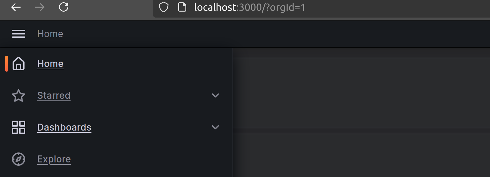
2. From here, click the blue `New` button and select `New Dashboard`.
3. To save your dashboard, either click `Ctrl+s` or click `Save Dashboard`
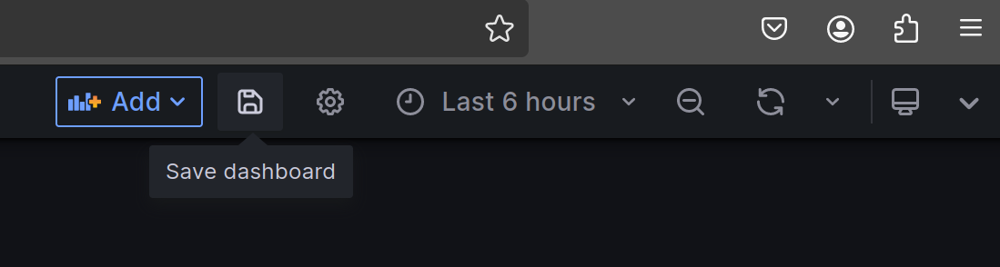 

### Populating the Dashboard
1. Inside of a dashboard, click the blue `+ Add Visualization` button
2. In the bottom left there is a section for an InfluxDB query to be added:
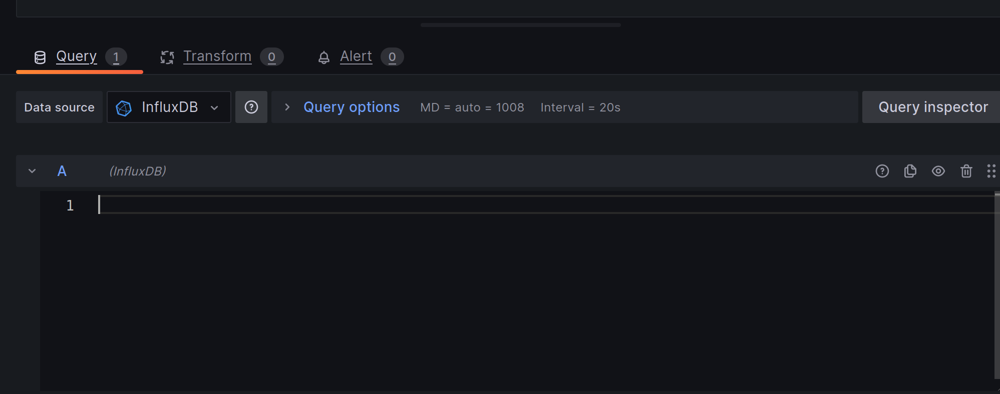
3. From here you have 2 options. Both are discussed in the subsections below.
    * Add a query to an InfluxDB bucket for data
    * Set Grafana to pull data from a livestream

#### Adding an Influx Query on a Panel
1. First, open InfluxDB (locally this is `http://localhost:8086`). 
2. Then check that the bucket you want to pull from even exists by navigating to the `Buckets` tab:
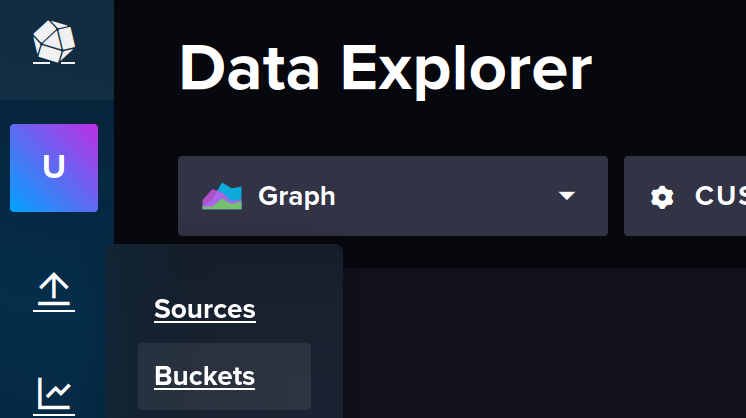
* If the bucket does not exist then add it.
3. Now, click the graph icon to go to the query builder/selection and data visualization menu:

4. Choose the bucket you want to look inside and then select the appropriate filters you want to use for your query. For example, if I want `MotorVelocity` **specifically** from the MCB (not MDI) **and** in the prod bukect I select the following:
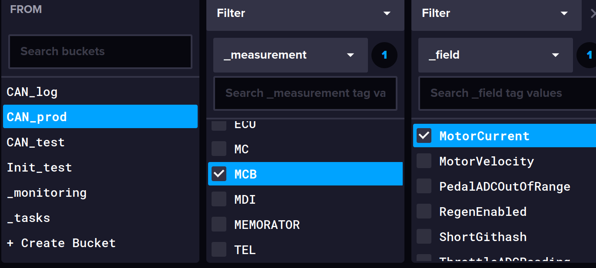
5. Now, to query this for Grafana, click the `Script Builder` button beside the blue submit button on the right and you will see the following:
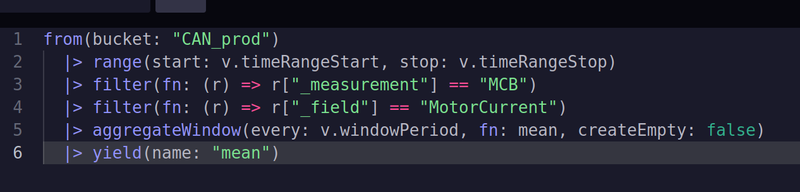
6. Copy paste this query into the InfluxDB query section on Grafana click the blue `Apply` button in the top right corner.
7. Now, as data comes in you will see the graph show up (assuming your time window is correct).

#### Pulling Livestreamed Data
1. First, you need to run `./link_telemetry.py -p /dev/ttyUSB0 -b 230400 --prod --live-on all`
    * This means we will use radio with USB connected at port `/dev/ttyUSB0`, baudrate `230400`, and we will be using the `prod` bucket.
    * Importantly, we are using the `--live-on all` flag to turn on all the live measurements. 
1. On Grafana, in the bottom left where the query options are inside the panel, select `Grafana` under Data Source:
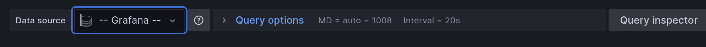
2. Then choose `Live Measurements` under Query Type:
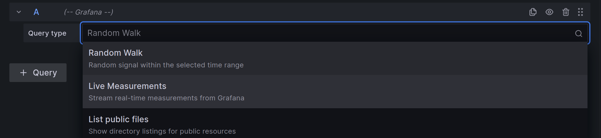
3. As messages come in, you will need to go through the various measurements channel and find the data you want to stream into the panel:
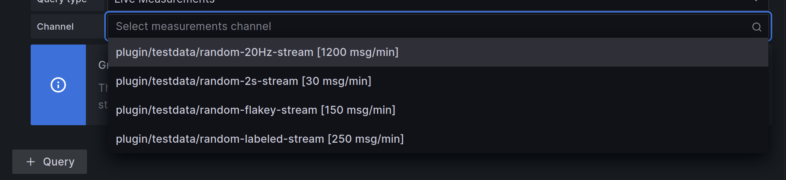
    * Alternatively, instead you can run `./link_telemetry.py -r can --prod --force-random --live-on all` without radio so that you can first set up the live stream dashboard with the messages you want and then during testing you dont need to search for the measurement channel as it comes in.

Now that the panel is populated, there are many options on the right bar for customizing the graph. These will be discussed in tips and tricks.

## Overalying Queries
A common use case is to overlay multiple graphs so that you can compare data and better understand how the system behaves and how each component responds differetly to its inputs. To achieve this in Grafana, all you need to do is edit the query to just pull from multiple sources. The easiest way to do this is as follows:

Lets say you want to overlay **Battery Current** (name of the signal which reports current pulled by motor from battery) and the **Pack Current** (the total current out the battery). Here are the steps to do this:
1. Create an empty visualization in Grafana
2. Open InfluxDB and create the query using their UI by selecting the **BatteryCurrent** and **PackCurrent** `_fields`:
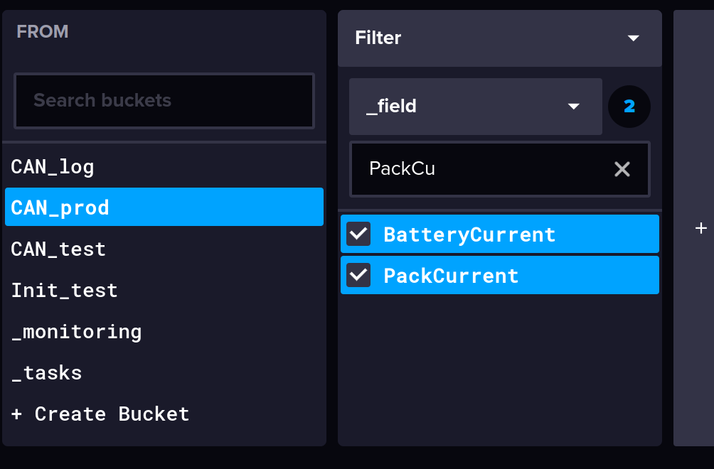
3. Then click the `Query Builder` button and copy the query into the Grafana query section:
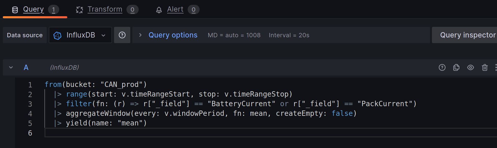
4. Now click **Apply** and you will see the graph overlayed. 

This is an example of the BusCurrent, LVCurrent, and PackCurrent overlayed:
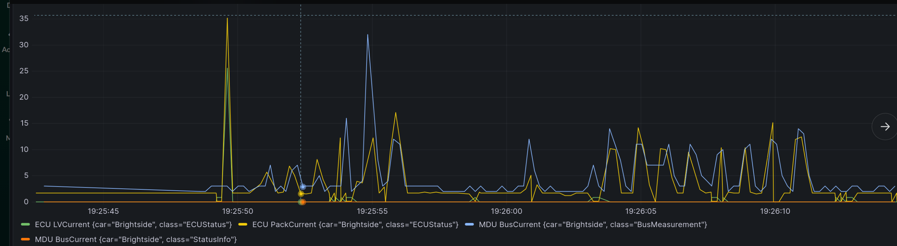

## Other Tips and Tricks
* If you want to just see a number instead of a graph (for example for states or for speed) it is useful to change the graph type to Stat:
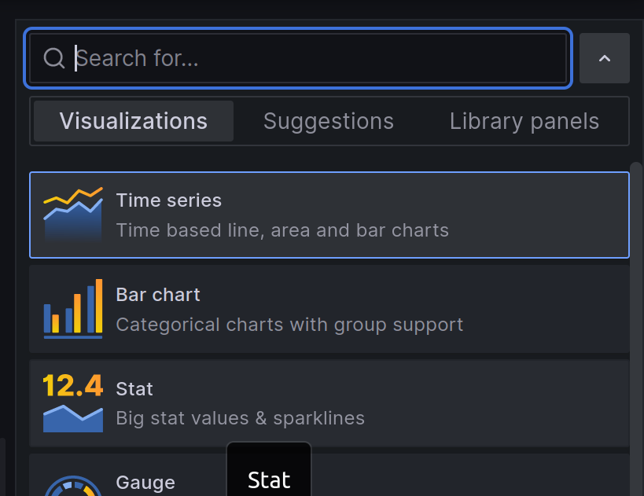
* To see the dashboard refresh at a 1s rate (or any other rate) click the gear icon in the top right corner. Then scroll down until you see **Auto Refresh** and then change the options to have `1s` in it. Save the dashboard and check the auto refresh interval and select 1s from it:
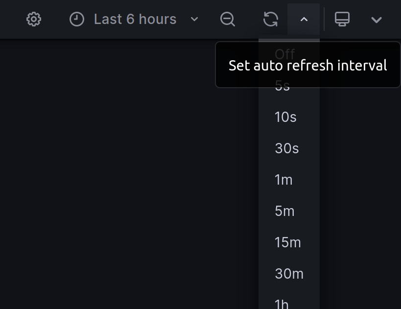
* For state data, seeing an average of the past states is not good because you will end up with non-integer states which is futile to interpret. To fix this, go to the query and change where it says `fn: mean` to `fn: last` and `yield(name: "mean")` to `yield(name: "last")`.
* To zoom in on a particular section of data as its coming in, click and drag on the graph to select the time window you want to zoom in on. This will pause the moving window and will also make the rest of the panels on that dashboard zoom in as well.