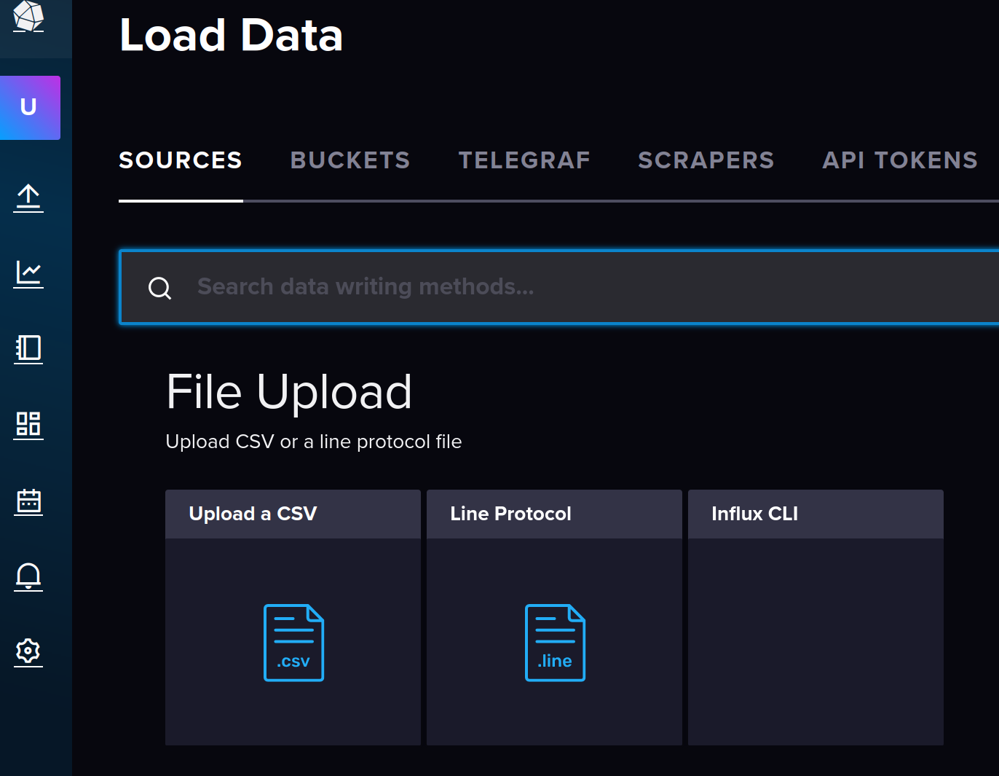
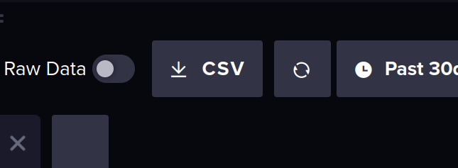

# Purpose of `INFLUXDB.md`
This doc aims to explain how to use influxdb to upload, download, and view our data.

## Uploading
There are two primary ways to upload data to influxDB. 
1. Upload a CSV onto the Web Browser InfluxDB instance by dragging and dropping,
    * 
2. Send data straight to InfluxDB with sunlink. Either memorator upload script or by running `./link_telemetry.py` live.

## Downloading
### Automatically Download CSV From InfluxDB (Not working on Bay Computer)
All you need to do is go to InfluxDB and you will see a CSV download button



Once you create the query you want it will download the CSV when you click the button.

### Running CSV Download Script
In the `scripts/` folder there is a script called `CSV_Download_script.sh`. To run this first make sure the script is executable by running:
1. `chmod +x CSV_Download_script.sh`
2. Then run `./scripts/CSV_Download_script.sh`
3. Then follow the instructions
[Video Tutorial](../videos/CSV_download_script_tutorial.mp4)

### Manually Downloading CSV Data onto Bay Computer
#### General Steps
TLDR: You will enter the InfluxDB docker container on the bay computer to run a command to download the CSV. Then you will transfer the csv to wherever you need it.
Note: These steps are exactly what the `CSV_Download_Script.sh` does.
1. First enter the bay computer shell. To do this run `ssh electrical@elec-bay`. Password is `elec2024`.
2. Go into the sunlink directory by running `cd sunlink`
3. Next enter the Influxdb docker container on the bay computer. Run `docker exec -it influxdb bash`
4. Next we need to enter the command to download the CSV. The way this works is by using an InfluxDB Query but in the Command line (note by default the return of all queries is a CSV that matches whatever you asked for). For us, run `influx query '[YOUR_QUERY]' --raw --token [BAY_INFLUX_TOKEN] > [PATH_TO_PUT_CSV]`. 
    * In our specific case you can do
    ```bash
    influx query 'from(bucket: "CAN_log") |> range(start: 2024-07-16, stop: 2024-07-22)' --raw --token lnxskTFjJ9gKofI-swJwR32jRvETg-aW-V-6cLe76i4nKwe7sYrljh4R2ctErwBMvo-6nMkseQWmbPzUQU_39Q== > FSGP.csv
    ```
    This command will get ALL the data from the CAN_log bucket from 2024 Competition and will put it in a CSV called `FSGP.csv` (in the directory you are currently in).
    * Note that this process takes a long time to complete (we had ~5GB of data for just comp....) so running `ls -l` periodically is helpful so you know the size of the csv as it grows.
5. Once this process completes we are going to zip/compress the file or else it will take ridiculously long to transfer. Run `gzip -k FSGP.csv`.
    * Using `ls -l` helps here as well
    * The `-k` option will not delete (keeps) the input file which in our case is `FSGP.csv`. Without this option, after you run `gzip FSGP.csv` `FSGP.csv` would be deleted and you will only have `FSGP.csv.gz`.
6. Now we will transfer the zipped CSV inside the InfluxDB container to the host (the bay computer). To do this open another shell/terminal in the bay computer (you need to run step 1 and 2 again) and then run `docker cp <SOURCE> <DEST>`. In our case we run `docker cp influxdb:/FSGP.csv.gz ~/sunlink/`.
7. **(OPTIONAL)** Now that the zipped CSV is on the bay computer you can do whatever you want with it. For example, I transferred it to my personal computer to analyse the data. To do this, from your personal computer's shell run `scp electrical@elec-bay:~/sunlink/FSGP.csv.gz .`.Now the zipped CSV is in the current directory you ran this command in,
8. **(OPTIONAL)** You can run `gzip -d -k FSGP.csv.gz` to unzip the csv.
The -k option will not delete (keeps) the input file.

#### Choosing Different Queries
Instead of using the query specified in the example above, we can instead do any query we want by simply replacing the text in the `[YOUR_QUERY]` section. To get the query to copy paste in, you need to go the InfluxDB and create a query on your own by doing the following:
1. Go to infliuxdb
2. Make the query you want using the UI
3. Go to Script Editor
4. Change the query as you wish (for example I completely remove any of the aggregate window stuff so I get the full data in that time.
5. Then copy that query straight into the `[YOUR_QUERY]` part of the command
    * For exmaple: battery current throughout the entire 2024 Competition:
        ```bash
            from(bucket: "CAN_log")
                |> range(start: 2024-07-16, stop: 2024-07-22)
                |> filter(fn: (r) => r["_measurement"] == "MC")
                |> filter(fn: (r) => r["_field"] == "BatteryCurrent")
        ```

## Viewing Data
To view our data your can either use Grafana [See `GRAFANA.md`](GRAFANA.md) or view it on InfluxDB itself. To perform the latter do the following
1. Open InfluxDB (either the bay computer link or localhost)
2. Go to the Data Explorer tab on the left of the screen (symbol looks like a lightning bolt on a xy plane). 
3. Create your query as you like and hit submit. This will generate the graph of the data for you.
    * I recommend changing the `Window Period` in the bottom right to `1ms` so that you can accuretly see how the data is changing.
    * You can zoom into the graph by highlighting (press and hold) a certain section of the total graph.
    * You can change the aggregate function to `last` instead of `mean` to get the exact value we received on Telemetry,
    * You can change the x and y axis as well as the graph type in the `Customize` tab in the top left.
